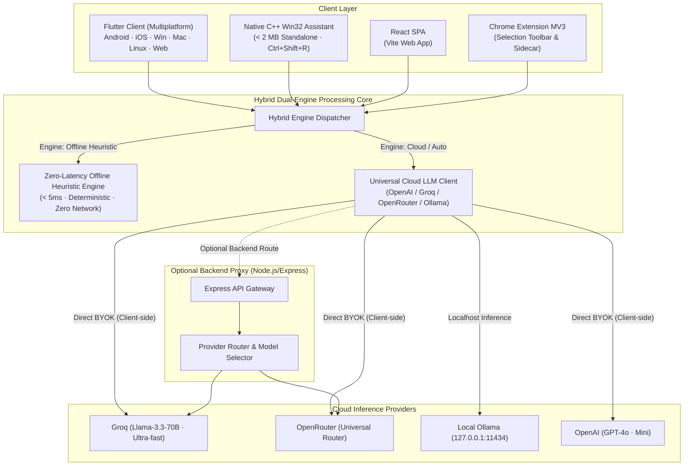
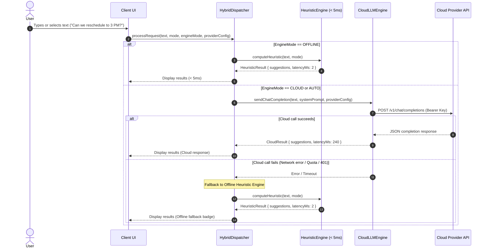

# SmartReply AI System Architecture

This document provides a comprehensive overview of the design, system components, execution flows, and security model of **SmartReply AI**.

---

## 1. System Overview & Philosophy

SmartReply AI is engineered around three non-negotiable principles:
1. **Zero-Latency Offline Guarantee**: The system provides immediate, deterministic responses (< 5ms) on-device using heuristic and rule-based NLP engines when offline or when no API key is configured.
2. **Universal Cloud Orchestration (BYOK - Bring Your Own Key)**: Any OpenAI-compatible provider (Groq, OpenRouter, Ollama, OpenAI, DeepSeek, Together) can be plugged in without vendor lock-in.
3. **True Cross-Platform Native Presence**: Available as Flutter (Android, iOS, macOS, Linux, Windows, Web), native Win32 C++ floating assistant, Rust/Tauri desktop, React Web SPA, and Chrome Extension MV3.

---

## 2. High-Level Architecture Diagram

---

## 3. Core Functional Modes

SmartReply AI implements four core modes aligned with Google ML Kit specifications:

| Mode | Capability | Offline Heuristic Fallback | Cloud LLM Enhancement |
| :--- | :--- | :--- | :--- |
| **Smart Reply** | Contextual quick responses to incoming chat/email | Sentiment classification, question extraction, intent templates (< 5ms) | Temperature-tuned, style-adapted (Casual, Formal, Concise, Enthusiastic) |
| **Smart Enhance** | Proofreading, style enhancement, grammar normalization | Regex punctuation fixes, capitalization normalization, filler-word pruning | Full semantic rewriting with nuance and tone preservation |
| **Smart Translate** | Instant cross-language conversion | Lexicon lookup (En, Es, Fr, De, Ja, Zh) for common communicative phrases | Nuanced multilingual contextual translation across 100+ languages |
| **Smart Summarize** | Distillation of long texts into punchy points | Extractive frequency scoring, paragraph splitting, leading sentence extraction | Abstractive bulleted or paragraph summaries with key takeaway extraction |

---

## 4. Execution Sequence: Hybrid Dispatcher

The hybrid dispatcher ensures seamless degradation when cloud inference is unavailable or fails:

---

## 5. Client Implementations

### A. Flutter Multiplatform (`smart_reply_app/`)
- **State Management**: Reactive state management with atomic widgets.
- **Service Layer**:
  - `HeuristicEngine`: Pure Dart regex and algorithmic text analysis.
  - `CloudLlmEngine`: HTTP client speaking OpenAI `/v1/chat/completions`.
  - `HybridDispatcher`: Mode management and fallback orchestration.
- **Component Hierarchy**:
  - `LatencyBadge`: Visual indicator showing engine source and execution latency in milliseconds.
  - `EngineModeChipBar`: Toggle between Auto, Cloud LLM, and Offline Heuristic.
  - `ModeTabBar`: Selector for Reply, Enhance, Translate, Summarize.
  - `StyleSelectorBar` & `LanguagePicker`: Contextual configuration controls.
  - `ProviderSettingsSheet`: Modal for custom Base URL, API Key, Model ID, and temperature.

### B. Native Win32 C++ Desktop (`desktop/`)
- **Technology**: Pure C++17 with Win32 API, GDI+, and WinINet.
- **Footprint**: Compiled binary is < 2 MB, requires no Electron or WebView2 runtime.
- **Workflow**:
  - Registers low-level system keyboard hook (`Ctrl+Shift+R`).
  - Simulates `Ctrl+C` to copy active selection into memory.
  - Displays a modern layered floating palette window next to the cursor.
  - On user selection, restores focus and injects replacement using `SendInput`.

### C. Chrome Extension MV3 (`extension/`)
- **Components**:
  - `background.js`: Service worker with built-in heuristic engine and context menu handling.
  - `content.js`: Injected script displaying a floating action pill when user highlights text in any web input or textarea.
  - `popup.html` & `popup.js`: Quick popup dashboard with full mode selection and provider key management using `chrome.storage.local`.

---

## 6. Security and Privacy Model

1. **Local-First Processing**: In offline mode, zero bytes leave the user's device. No telemetry, analytics, or background pings exist.
2. **Bring Your Own Key (BYOK)**: API keys are stored strictly in client-side secure storage (`SharedPreferences` on Flutter, `chrome.storage.local` in extension, Windows Registry / credential vault for desktop).
3. **No Central Intermediary**: Client applications make direct HTTPS calls to the provider endpoint chosen by the user (OpenAI, Groq, Ollama). When the local Node.js proxy is used, it acts solely as a stateless router.
4. **Local LLM Friendly**: Native support for `http://127.0.0.1:11434` (Ollama) allows completely private, locally hosted AI models with no third-party data transmission.
