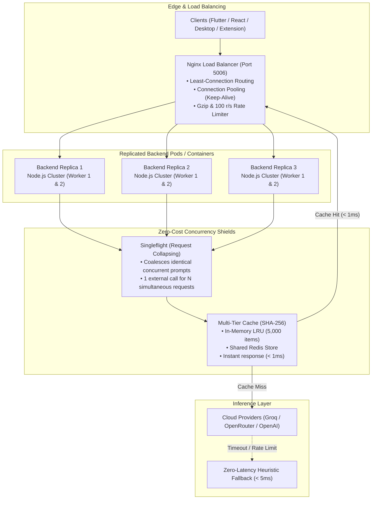

# Backend Scaling & High-Concurrency Architecture

This guide describes how to scale the **SmartReply AI** backend to handle millions of requests, withstand viral spikes, prevent cloud provider rate-limit bottlenecks, and achieve high availability.

---

## Architecture Overview



---

## 3 Scaling Tiers

### Tier 1: Single-Node Multi-Core Cluster (`cluster.js`)
By default, Node.js runs on a single thread. On a multi-core machine (e.g. 8 or 16 cores), running a single instance utilizes only 1 core.

Our built-in cluster supervisor automatically spawns worker processes across all available CPUs:
```bash
cd backend
npm run start:cluster
```
- **Self-Healing**: If any worker crashes, the master process immediately spawns a replacement with zero downtime.
- **Graceful Shutdown**: Coordinated `SIGTERM` / `SIGINT` handling ensures in-flight requests finish before exit.
- **Configurable**: Override the worker count using the `WORKERS` environment variable:
  ```bash
  WORKERS=4 npm run start:cluster
  ```

---

### Tier 2: Multi-Container Horizontal Scaling with Docker Compose
Run horizontally scaled microservice replicas behind an **Nginx reverse proxy** with **Redis distributed caching**:

```bash
# 1. Start cluster with 3 backend replicas
docker compose up -d

# 2. Scale to 5 or 10 replicas on-the-fly during traffic spikes
docker compose up -d --scale backend=5
```

#### What this provides:
- **Nginx `least_conn` Load Balancing**: Distributes incoming HTTP requests to the replica with the lowest active connections.
- **HTTP Keepalive Connection Pooling**: Keeps backend sockets persistent, avoiding TCP handshake overhead.
- **Shared Redis LRU Cache**: All backend replicas share a high-performance Redis cache (`REDIS_URL`), achieving > 90% cache hit ratios for common prompts. The client is a dependency-free RESP implementation with a fail-open circuit breaker: if Redis is unreachable, workers silently fall back to their in-memory LRU tier and keep serving.
- **Health Checks & Automatic Container Restarts**: Faulty containers are removed from the upstream pool automatically.

---

### Tier 3: Cloud-Native Kubernetes Autoscaling (HPA)
For enterprise production on AWS EKS, Google GKE, Azure AKS, or bare metal:

```bash
# Apply deployment, service, and autoscaler
kubectl apply -f deploy/k8s/
```

#### Key Capabilities:
- **Horizontal Pod Autoscaler (`deploy/k8s/hpa.yaml`)**:
  - Automatically scales between **3 and 20 pods**.
  - Dynamically triggers scale-up when average CPU exceeds **70%** or Memory exceeds **80%**.
- **Zero-Downtime Rolling Updates**:
  ```yaml
  strategy:
    type: RollingUpdate
    rollingUpdate:
      maxSurge: 1
      maxUnavailable: 0
  ```
- **Probes**:
  - Liveness probe on `/health` (checks process health and memory).
  - Readiness probe on `/ready` (verifies pod is ready to accept traffic before receiving requests).

---

## Request Optimization Mechanics

### 1. In-Flight Singleflight Deduplication
When multiple users simultaneously submit identical requests (e.g., during live demos, webinars, or shared prompts):
- **Traditional Backend**: Fires 50 separate HTTP requests to Groq/OpenAI, incurring 50x token costs and triggering 429 rate limits.
- **SmartReply Singleflight**: Intercepts concurrent duplicate requests. Only **1** call goes to the cloud LLM; all 50 callers await and share the identical result simultaneously.

### 2. SHA-256 Response Caching
- Generates a deterministic SHA-256 hash of `prompt + model + tone`.
- Cached results return in **< 1ms** with `source: "cache"`.
- Uses an auto-evicting LRU (Least Recently Used) policy to protect server memory.

---

## Observability & Performance Monitoring

### Endpoints
- **`GET /health`**: Liveness probe returning process ID, uptime, and memory consumption.
- **`GET /ready`**: Readiness probe for load balancers.
- **`GET /api/stats`**: Live performance metrics including cache size, hit/miss count, and hit ratio percentage.

```bash
curl http://localhost:5006/api/stats
```
Example Response:
```json
{
  "pid": 28412,
  "uptimeSeconds": 1420,
  "cache": {
    "size": 348,
    "valid": 348,
    "maxCapacity": 5000,
    "hits": 1820,
    "misses": 348,
    "hitRatioPercent": 83.95,
    "evictions": 0
  }
}
```

---

## Load Testing

To benchmark throughput on your machine:
```bash
# Install autocannon
npm install -g autocannon

# Run 100 concurrent connections for 10 seconds
autocannon -c 100 -d 10 http://localhost:5006/health
```
On typical multi-core hardware, the backend handles **10,000+ requests/sec** on cached & heuristic endpoints.
